# radixInfer

[English](README.md) | [简体中文](README.zh-CN.md)

`radixInfer` is a layered LLM serving system with a runnable end-to-end control plane. It keeps API handling, transport, runtime scheduling, cache management, and engine execution clearly separated.

## Features

- FastAPI-based HTTP service with SSE streaming
- OpenAI-compatible `/v1/completions` and `/v1/chat/completions` endpoints
- Interactive shell mode for local debugging
- Multi-process architecture: API, tokenizer, and runtime in separate processes
- Decode-first overlap scheduler (prefill/decode/mixed batches)
- Radix-tree prefix cache with heap-based LRU eviction
- Paged KV cache with shared-prefix support
- Llama-family model factory (Llama, Mistral, Qwen2, Qwen3, Qwen3-MoE)
- Pluggable attention backends (FlashInfer / FlashAttention / HF fallback)
- Tensor parallelism support

## Repository Structure

Main packages under `python/radixinfer`:

| Package | Purpose |
|---|---|
| `api` | HTTP routes, schemas, SSE/JSON rendering |
| `server` | Frontend orchestration, listener lifecycle, backend startup |
| `transport` | ZMQ/queue adapters, protocol types, tokenizer worker, detokenization |
| `runtime` | Scheduler, prefill/decode managers, cache manager, runtime I/O |
| `cache` | Page pool, radix prefix cache, KV pool |
| `engine` | Model execution, CUDA graph, sampling, distributed setup |
| `models` | Model registry, configs, weights, model implementations |
| `distributed` | Tensor-parallel communication helpers |
| `layers` | Transformer building blocks (attention, linear, norm, embedding) |

## Quick Start

### Requirements

Python 3.10+. Core dependencies: `fastapi`, `pyzmq`, `torch`, `transformers>=4.40`, `uvicorn`, `pydantic>=2.0`.

### Run the Server

```bash
# Debug model (no GPU, no model download)
PYTHONPATH=python python -m radixinfer --model debug --device cpu --port 1919

# Real model on GPU
PYTHONPATH=python python -m radixinfer --model Qwen/Qwen3-0.6B --device cuda:0
```

### Shell Mode

```bash
PYTHONPATH=python python -m radixinfer --model debug --device cpu --shell
```

Shell commands: `/reset` (clear history), `/exit` (quit).

### Run Tests

```bash
pytest -q
```

## CLI Options

| Flag | Default | Description |
|---|---|---|
| `--host` | `127.0.0.1` | HTTP bind host |
| `--port` | `1919` | HTTP port |
| `--model` | `debug` | Model name or path |
| `--device` | `auto` | `cpu`, `auto`, or `cuda:N` |
| `--tp-size` | `1` | Tensor-parallel size |
| `--num-pages` | derived | Total KV cache pages |
| `--page-size` | `16` | Tokens per KV page |
| `--max-prefill-length` | `2048` | Prefill token budget per tick |
| `--dist-port` | auto | Distributed rendezvous port |
| `--disable-zmq` | off | Use `mp.Queue` instead of ZMQ |
| `--shell` | off | Launch shell mode |

## API Endpoints

| Endpoint | Description |
|---|---|
| `GET /v1/models` | Model listing |
| `POST /generate` | Simple generation (plain SSE or JSON) |
| `POST /v1/completions` | OpenAI text completion |
| `POST /v1/chat/completions` | OpenAI chat completion |

All generation endpoints support streaming (`stream=true`) and non-streaming. `n > 1` is not currently supported.

## Architecture Overview

```
HTTP Request
  → API Server (FastAPI + SSE)
  → FrontendManager → TokenizerWorker [separate process]
  → [ZMQ or mp.Queue]
  → Scheduler [separate process]
      DecodeManager  — dict[uid, Req], decode-first drain
      PrefillManager — prefix cache match, chunked prefill
      CacheManager   — paged alloc, lazy-free, H2D scatter
      RadixPrefixCache — radix tree + heap-based LRU eviction
  → Engine
      Model (Llama / Qwen2 / Qwen3 / Qwen3-MoE / Mistral)
      KV Cache (paged MHA)
      CUDA Graph Runner
      Sampler
  → DetokenizeRequest → TokenizerWorker → StreamChunk → SSE
```

The scheduler runs an overlap loop by default: GPU execution for batch N overlaps with CPU post-processing of batch N-1.

## Documentation

- [简体中文 README](README.zh-CN.md)
- [Architecture](docs/architecture.md) — subsystem design, algorithms, data flow
- [Developer Guide](docs/developer-guide.md) — internals, module descriptions, reading order
- [API Guide](docs/api-guide.md) — endpoint reference with request/response shapes
- [Development Guide](docs/development.md) — local workflow, test commands

## Benchmarks

> **Environment:** 2× NVIDIA RTX 4090 D (24 GB), TP=2, Qwen/Qwen3-8B (bfloat16), input 512 tokens, output 256 tokens, 200 requests per run, 8 warmup requests.

### Engine Comparison at Concurrency = 16

| Engine | Output (tok/s) | TTFT mean | TPOT mean | Latency p99 |
|---|---|---|---|---|
| radixInfer | 261.7 | 3764 ms | 45.7 ms | 17.60 s |
| vLLM | 262.9 | 1743 ms | 53.4 ms | 20.42 s |
| SGLang | 261.6 | 5746 ms | 37.2 ms | 16.18 s |

<p align="center">
  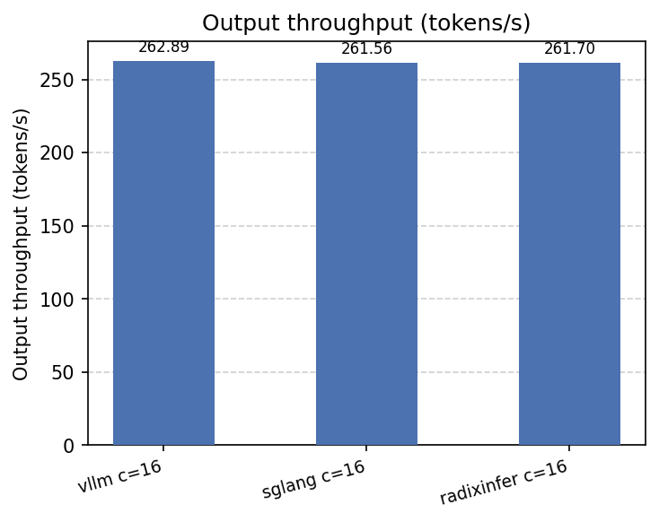
  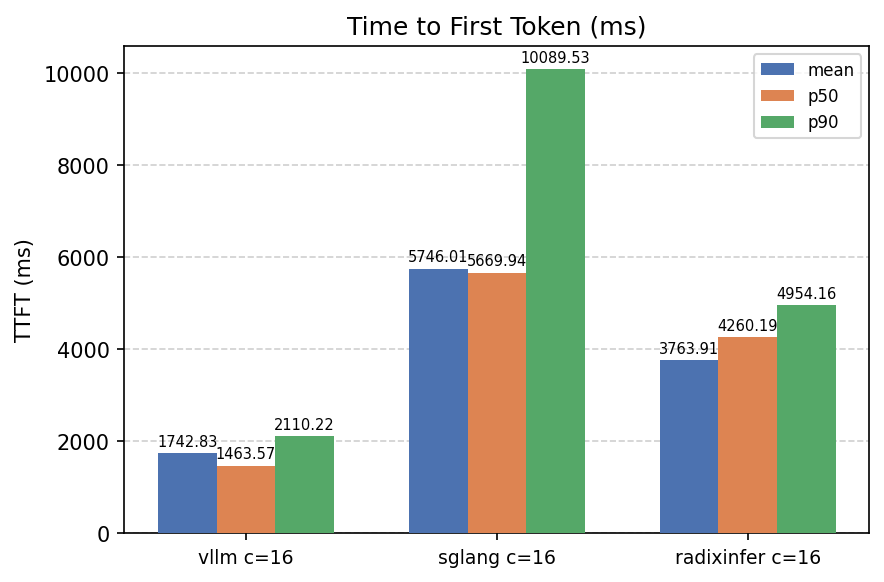
  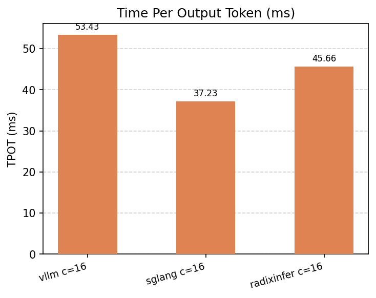
</p>

### Concurrency Sweep

Output throughput (tok/s) across concurrency levels 1 / 4 / 8 / 16 / 32:

| Engine | c=1 | c=4 | c=8 | c=16 | c=32 |
|---|---|---|---|---|---|
| radixInfer | 77 | 177 | 222 | 262 | 287 |
| vLLM | 77 | 176 | 224 | 263 | 286 |
| SGLang | 78 | 176 | 222 | 262 | 284 |

<p align="center">
  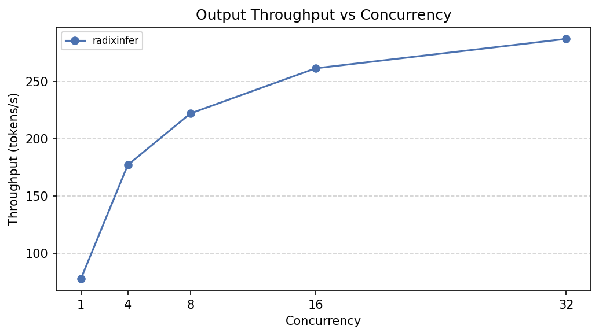
  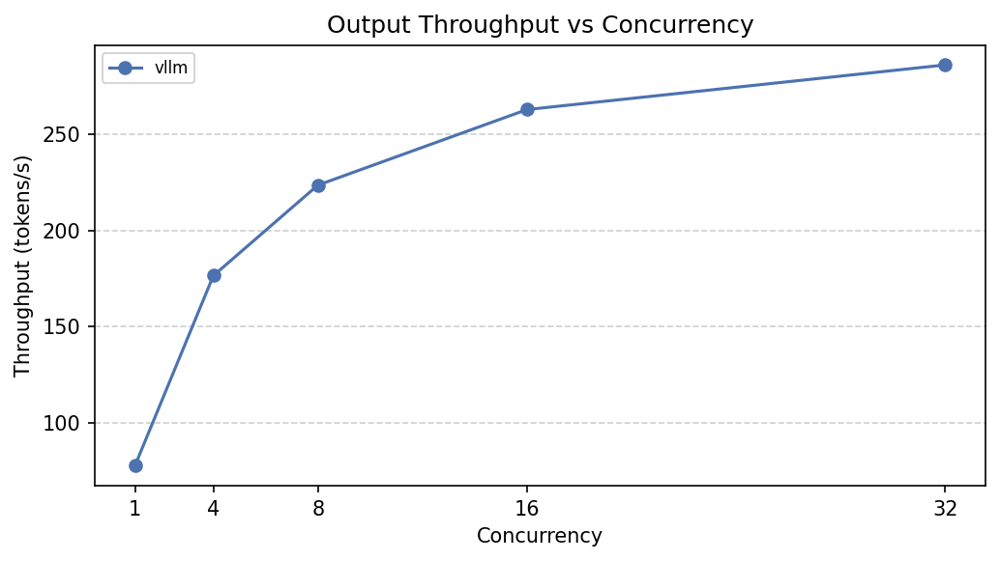
  
</p>

### Burst Run (200 Requests, Concurrency = 200, Input = 512, Output = 256)

All 200 requests are submitted to the engine at once to measure peak throughput under uncapped burst load.

| Engine | Output (tok/s) | Requests (req/s) | TTFT mean | TPOT mean | Latency p99 |
|---|---|---|---|---|---|
| radixInfer | 295.8 | 1.155 | 79.20 s | 142.1 ms | 170.46 s |
| vLLM | 286.5 | 1.119 | 81.75 s | 156.2 ms | 178.62 s |
| SGLang | 291.5 | 1.139 | 80.13 s | 92.2 ms | 175.56 s |

<p align="center">
  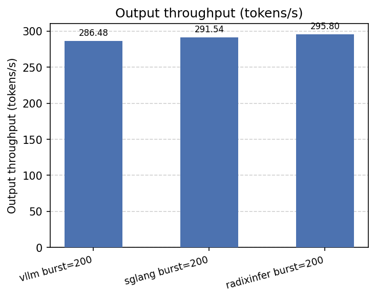
  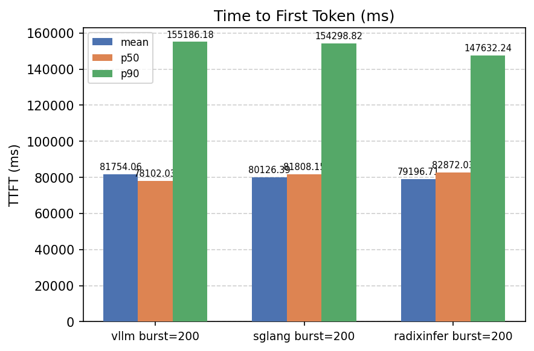
  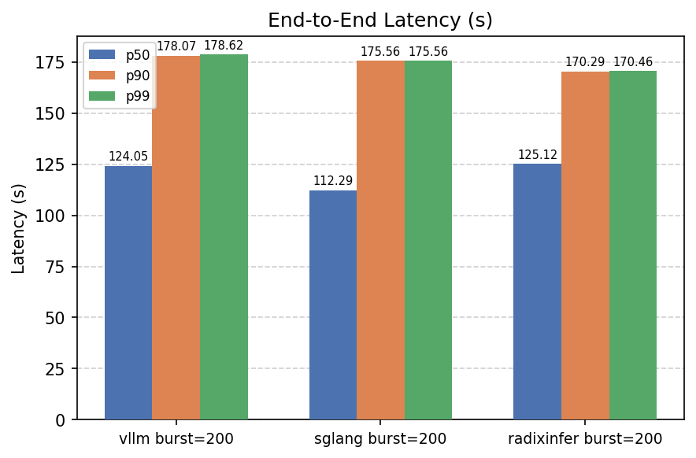
</p>

### Burst Run (200 Requests, Concurrency = 200, Input = 128, Output = 128)

This shorter prompt/output setup shows the peak burst throughput when prefill pressure is lighter and all 200 requests are still submitted at once.

| Engine | Output (tok/s) | Requests (req/s) | TTFT mean | TPOT mean | Latency p99 |
|---|---|---|---|---|---|
| radixInfer | 1057.7 | 8.263 | 11.35 s | 98.7 ms | 24.15 s |
| vLLM | 1120.8 | 8.756 | 10.92 s | 89.3 ms | 22.80 s |
| SGLang | 1123.4 | 8.776 | 10.38 s | 96.6 ms | 22.78 s |

<p align="center">
  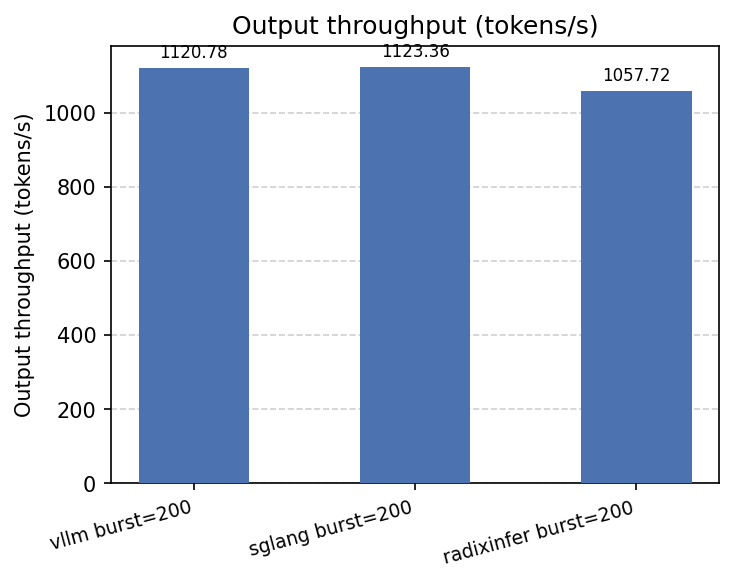
  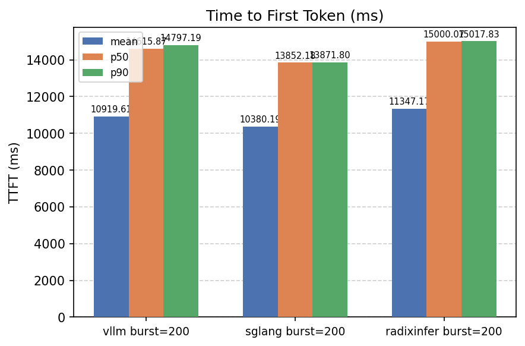
  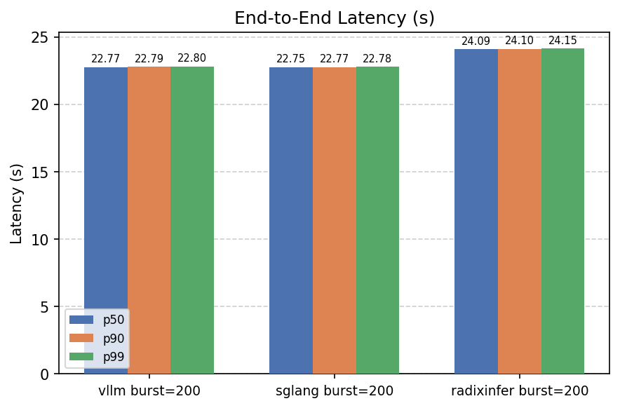
</p>

### Prefix Cache Effect (radixInfer, concurrency = 16)

400-token shared prefix across all requests:

| | Output (tok/s) | TTFT mean |
|---|---|---|
| No prefix cache | 262 | 3764 ms |
| Prefix cache hit | 1004 | 63 ms |

<p align="center">
  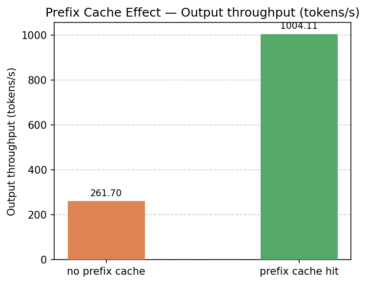
  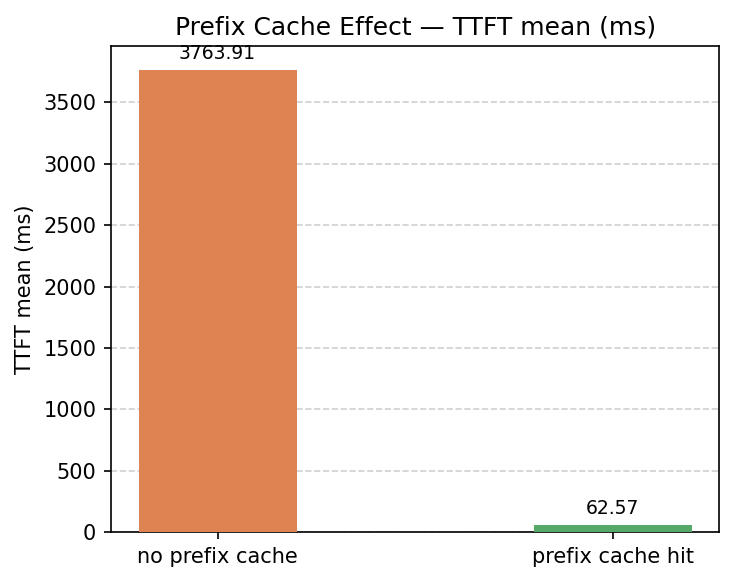
</p>

### Input-Length Sweep (radixInfer, concurrency = 16)

| Input tokens | Output (tok/s) | TTFT mean |
|---|---|---|
| 128 | 773 | 556 ms |
| 512 | 267 | 3716 ms |
| 1024 | 147 | 4374 ms |
| 2048 | 75 | 17269 ms |

<p align="center">
  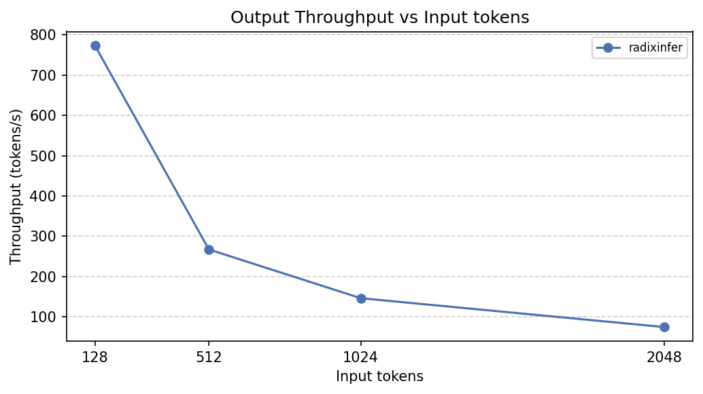
  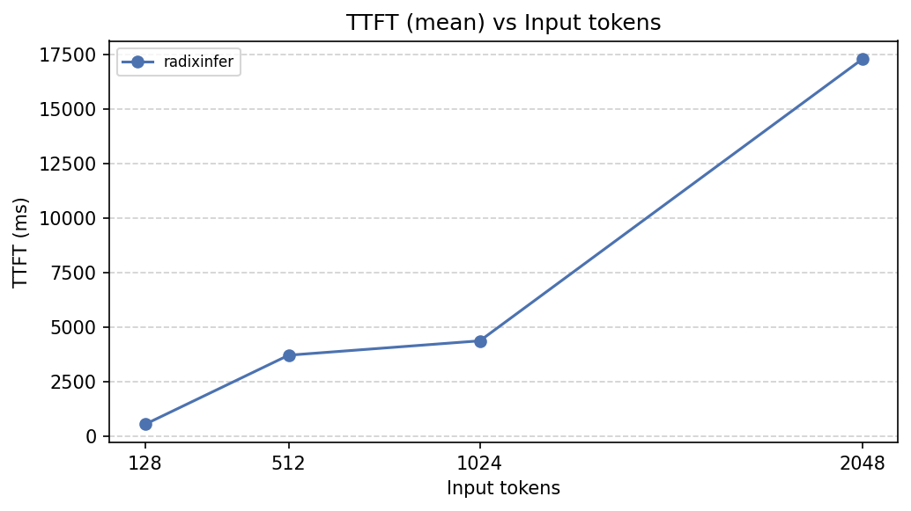
</p>

## Current Status

The control plane (API, transport, scheduling, cache) is substantially complete and end-to-end runnable. Remaining work:

- Real FlashAttention/FlashInfer attention backends (HF fallback currently)
- ZMQ overlap scheduler edge cases under sustained TP load
- Full OpenAI API compatibility (`n > 1`, broader schema coverage)

## Acknowledgements

- [vLLM](https://github.com/vllm-project/vllm) — production-grade LLM serving engine; used as a benchmark baseline and reference for paged KV cache design.
- [SGLang](https://github.com/sgl-project/sglang) — high-throughput LLM serving with RadixAttention; used as a benchmark baseline and reference for radix-tree prefix reuse.
- [mini-sglang](https://github.com/sgl-project/mini-sglang) — A compact implementation of SGLang, designed to demystify the complexities of modern LLM serving systems.
